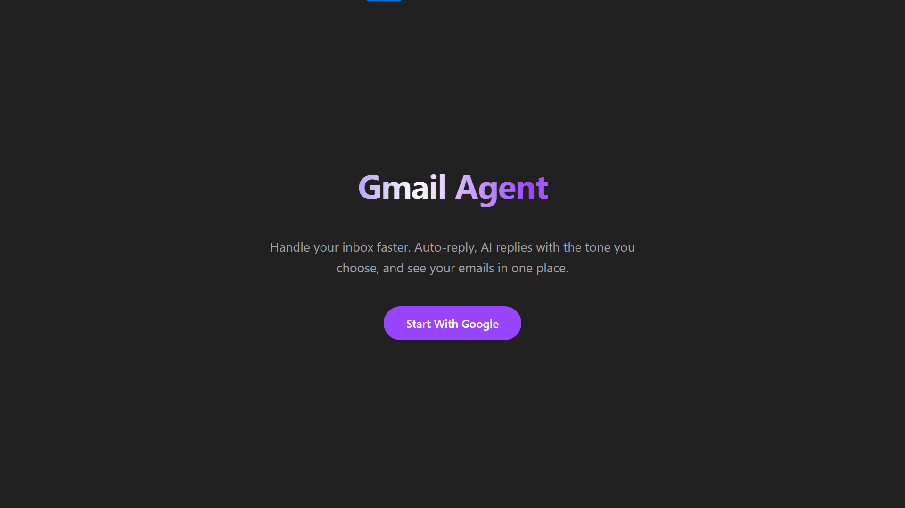

# Gmail Agent

A Next.js app that helps you handle your inbox faster. Sign in with Google, view your emails, generate AI-powered replies with the tone you choose, and send them directly from the app.



## Features

- **Google OAuth** – Sign in with your Google account
- **Inbox view** – See your emails in one place
- **AI reply** – Generate replies with Gemini (Professional, Casual, or Friendly tone)
- **Send reply** – Send the AI-generated reply via Gmail API

## Tech Stack

- **Next.js 16** – React framework with App Router
- **NextAuth** – Authentication with Google provider
- **Prisma** – Database ORM (PostgreSQL)
- **Google Gemini** – AI for generating email replies
- **Gmail API** – Read and send emails
- **Tailwind CSS** – Styling

## Project Structure

```
app/
├── api/
│   ├── ai/reply/     # AI reply generation (Gemini)
│   ├── auth/         # NextAuth routes
│   └── gmail/
│       ├── emails/   # List emails, get single email
│       └── send/     # Send email
├── components/       # SignInButton
├── inbox/            # Inbox page + InboxClient
├── layout.tsx
├── page.tsx          # Landing page
└── globals.css
lib/
├── auth.ts           # NextAuth config
├── gmail.ts          # Gmail API client from OAuth tokens
└── prisma.ts         # Prisma client
prisma/
└── schema.prisma     # Auth models (User, Account, Session)
```

## How It Works

### Authentication

- Uses NextAuth with Google provider and Prisma adapter
- Stores OAuth tokens (access_token, refresh_token) in the database
- Scopes: `gmail.readonly`, `gmail.send`, user info
- `lib/auth.ts` – config; `app/api/auth/[...nextauth]/route.ts` – API route

### Reading Emails

- `lib/gmail.ts` – loads the user’s Google account from DB, builds an OAuth2 client, returns a Gmail API client
- `GET /api/gmail/emails` – lists messages (id, threadId, subject, from, snippet)
- `GET /api/gmail/emails/[id]` – fetches full message body (plain or HTML)

### AI Reply

- `POST /api/ai/reply` – accepts `emailSubject`, `emailFrom`, `emailBody`, `tone`, `userName`
- Uses Google Gemini (`gemini-2.5-flash-lite`) to generate a reply
- Prompt includes rules, email structure, and tone instructions
- Returns `{ reply: string }`

### Sending Emails

- `POST /api/gmail/send` – accepts `to`, `subject`, `body`, `threadId` (optional)
- Builds RFC 2822 MIME message, base64url-encodes it
- Calls `gmail.users.messages.send` with optional `threadId` for replies

### Inbox UI

- `InboxClient` – client component that fetches emails, shows list + detail panel
- Tone selector (Professional, Casual, Friendly) → calls AI reply API
- Suggested reply panel with Copy and Send buttons
- Send uses `handleSendReply` → extracts recipient from `From`, builds `Re:` subject, calls send API

## Setup

1. **Clone and install**

   ```bash
   npm install
   ```

2. **Database**

   - PostgreSQL database
   - Create `.env` with `DATABASE_URL`
   - Run `npx prisma migrate dev` and `npx prisma generate`

3. **Google OAuth**

   - [Google Cloud Console](https://console.cloud.google.com/) → Create project
   - APIs & Services → Credentials → Create OAuth 2.0 Client ID (Web app)
   - Add authorized redirect URI: `http://localhost:3000/api/auth/callback/google`
   - Add to `.env`: `GOOGLE_CLIENT_ID`, `GOOGLE_CLIENT_SECRET`

4. **Gemini API**

   - [Google AI Studio](https://aistudio.google.com/) → Get API key
   - Add to `.env`: `GOOGLE_AI_API_KEY`

5. **Env**

   ```env
   DATABASE_URL="postgresql://..."
   NEXTAUTH_URL="http://localhost:3000"
   NEXTAUTH_SECRET="your-secret"
   GOOGLE_CLIENT_ID="..."
   GOOGLE_CLIENT_SECRET="..."
   GOOGLE_AI_API_KEY="..."
   ```

6. **Run**

   ```bash
   npm run dev
   ```

## Demo

Want to try the live demo? Contact me to be added as a tester. The app uses Google OAuth in testing mode, so only approved testers can sign in.

## Note

It took a lot of time to read the documentation and debug errors, especially since it was my first time using the Gmail API and the Gemini API. If you run into similar issues, the official docs and community guides are very helpful.

